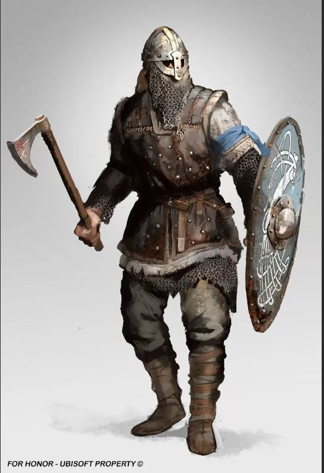

# Instruction to work with markdown

## Text marking

чтобы выделить текст курсивом, необходимо обрамить его звёздочками (*) или знаком нижнего подчёркивания (_). Например *вот так* или _вот так_

Чтобы выделить текст полужирным, необходимо обрамить ег двойными звёздочками (**) или двойным знаком нижнего подчёркивания (__). Например **вот так** или __вот так__ 

Альтернативные способы выделения текста жирным или курсивом нужны для того, чтобы мы могли совмещать эти два способа. Например, _текст может быть выделен курсивом и при этом быть **полужирным**_

## Lists

Чтобы выделить ненумерованный список используйте (*)

## Work with images

Чтобы загрузить иображение достаточно: 

## Links

## Work with tables

## Quotations

## Conclusion